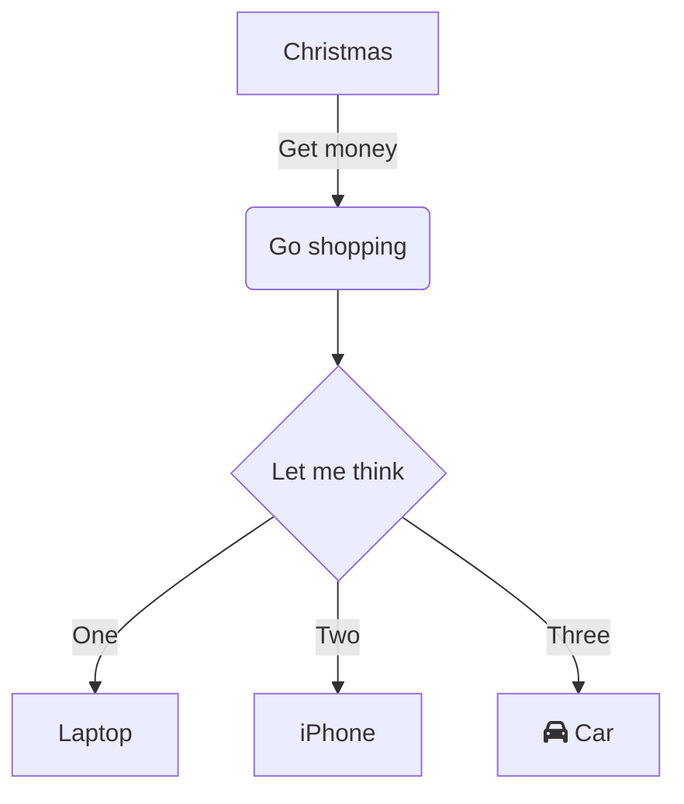

# Preview Tool for figures

##  Technology used
- Visual Studio 2019 or Visual Studio 2022
- Forms Development (C#, .Net Framework 4.7.2)
- Version 9.3.1 of Highcharts locally downloaded
- Microsoft Edge WebView2 component to display Highcharts figures. 
	- https://docs.microsoft.com/en-us/microsoft-edge/webview2/
	- https://docs.microsoft.com/en-us/microsoft-edge/webview2/how-to/machine-setup
	- https://developer.microsoft.com/en-us/microsoft-edge/webview2/

